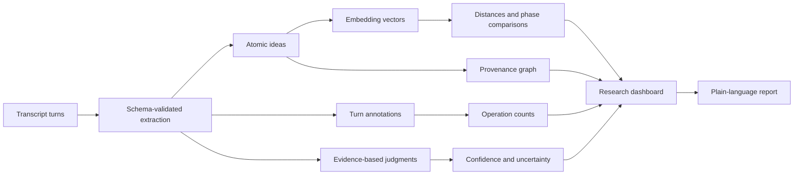

# Locus

**See how your ideas move with LLMs.**

Locus is an open-source human–AI creativity experiment. It guides someone through a short creative conversation, separates the ideas contributed by the human and the model, and produces two views of the interaction:

- a plain-language personal report about how the collaboration appeared to affect the participant's thinking; and
- an evidence-linked research dashboard for inspecting idea provenance, semantic movement, creative operations, uncertainty, and the underlying transcript.

> **Try it:** [Open the live Locus experiment](https://locus-ai-creativity.vercel.app)


## Why I built this

I graduated from the University of Pennsylvania with a degree in cognitive science. A friend working in Adam Green's lab introduced me to his research, and I became fascinated by a question that already felt personally important: when I use AI constantly, is it extending my creativity, redirecting it, or quietly narrowing it?

I built Locus as a way to understand those ideas more concretely. Rather than assigning a single opaque “creativity score,” the project tries to reconstruct what happened during one interaction: which ideas began with the human, what the model introduced, where the human challenged or reframed the model, and what emerged only through collaboration.

Locus is an independent exploratory project. It is not affiliated with or endorsed by Adam Green, Georgetown University, or the University of Pennsylvania.

## The participant experience

The guided protocol moves through five stages:

1. **Baseline ideation** — the participant develops initial directions before the model contributes concepts.
2. **Creative cue** — the participant is explicitly asked to make a less obvious connection.
3. **Co-creation** — human and model extend, challenge, branch, and synthesize ideas together.
4. **Independent thinking** — the model stops supplying ideas and the participant takes the concept somewhere new.
5. **Reflection** — the participant identifies what surprised them and when the direction felt like their own.

There is no countdown. A participant can think at their own pace and finish once they have provided at least one response.

## What the analysis measures

Every completed session is analyzed from its actual transcript. The report does not substitute a canned sample if analysis fails.

### Idea structure and agency

- atomic idea extraction
- human, AI, or co-created provenance
- idea genealogy and parent relationships
- human and AI branch creation
- human initiation
- AI amplification
- challenge rate
- synthesis and reframing
- possible AI preemption
- co-creative emergence

### Movement and change

- semantic trajectory across the conversation
- mean semantic distance between consecutive ideas
- conceptual diversity across human ideas
- lexical diversity in human responses
- baseline, cued, and post-AI novelty
- AI creative pull
- divergence recovery after the model steps back
- generative fluency and evaluative depth
- response-time metadata

Each research metric includes a display value, raw value where applicable, interpretation, confidence level, uncertainty statement, and links to supporting transcript turns.

## How it works

```text
Guided conversation
        │
        ▼
Complete transcript + phases + response timing
        │
        ├── Structured model analysis
        │     atomic ideas, provenance, genealogy,
        │     operations, judgments, evidence links
        │
        └── Embedding analysis
              semantic distances, conceptual diversity,
              phase novelty, AI pull, trajectory projection
        │
        ▼
Personal report + inspectable research dashboard
```

The analysis endpoint uses schema-validated structured output for text-dependent classification and interpretation. Deterministic application code then calculates counts, ratios, timing summaries, cosine-distance measures, and the semantic-map projection. Invalid evidence references and forward-pointing genealogy links are rejected before results reach the interface.

If the model call or embedding step fails, Locus shows an explicit retry screen. It does not fall back to example measurements.

## Inside the analysis engine

The post-conversation analysis is a hybrid pipeline. A language model handles tasks that require interpreting meaning; application code handles the mathematical comparisons. Keeping those layers separate makes it possible to see which outputs are calculated, which are judgments, and what evidence each judgment used.



### 1. Transcript normalization

Every message enters the analysis with four pieces of context:

```ts
{
  id: 8,
  role: "human",
  phase: "Independent",
  text: "...",
  responseMs: 37_000
}
```

The phase is part of the experimental protocol rather than something inferred after the fact. This lets the analysis compare human ideas before model input, after the creativity cue, during co-creation, and after the model steps back.

### 2. Atomic idea extraction and genealogy

The structured analysis decomposes compound responses into the smallest conceptually meaningful ideas. Each extracted idea receives:

- a short label and summary;
- a source: `human`, `ai`, or `co-created`;
- the originating transcript turn and protocol phase;
- zero or more parent idea IDs;
- a branch flag indicating whether it opened materially different territory; and
- a confidence label.

Together, the parent IDs form a directed idea genealogy. The server rejects duplicate idea IDs, references to nonexistent turns, and parent relationships that point forward in time. Questions are not counted as ideas unless they introduce an actual conceptual seed.

### 3. Semantic representation

For every atomic idea, Locus embeds the combined label and summary as a vector `eᵢ`. The basic semantic-distance operation is cosine distance:

```text
d(i, j) = clamp(1 − cosineSimilarity(eᵢ, eⱼ), 0, 1)
```

A value near `0` means the vectors occupy similar semantic territory in the selected embedding space. A larger value means they are farther apart. This is model-relative geometry—not a universal psychological distance.

### 4. Deterministic calculations

Once extraction and embeddings are complete, the following values are calculated in TypeScript rather than invented by the language model:

| Measure | Calculation | What it is intended to describe |
| --- | --- | --- |
| **Mean semantic distance** | Mean `d(i−1, i)` across consecutive ideas | How far the conversation moved from one extracted idea to the next |
| **Conceptual diversity** | Mean pairwise distance across all human ideas | How widely the participant's ideas spread through the embedding space |
| **Per-idea novelty** | Minimum distance from an idea to every earlier idea | How unlike the prior conversation each new idea was |
| **Baseline / cued / post-AI novelty** | Mean per-idea novelty for human ideas in that phase | Within-session change around the cue and AI withdrawal |
| **Human initiation** | Human-originated root ideas ÷ all root ideas | How many idea lineages began with the participant |
| **Human / AI branch creation** | Count of source-specific ideas marked as new branches | Who opened new conceptual directions |
| **Challenge rate** | Human turns classified as challenges ÷ all human turns | How often the participant questioned, rejected, or reversed a contribution |
| **Lexical diversity** | Unique human word tokens ÷ all human word tokens | Surface-level vocabulary variation |
| **Generative fluency** | Number of atomic human ideas | How many distinct human-originated concepts were extracted |
| **Synthesis / reframing** | Counts of annotated operation turns | How often ideas were combined or the governing frame changed |
| **Response timing** | Median recorded human response time | Interaction pacing, including reading and typing time |

Two collaboration-specific calculations require the provenance graph:

```text
AI creative pull
  = 1 − mean distance(human idea, each direct AI parent)

AI centroid
  = mean embedding of all AI-originated ideas

Divergence recovery
  = mean distance(independent human ideas, AI centroid)
    − mean distance(co-creation human ideas, AI centroid)
```

Higher **AI creative pull** means human ideas stayed semantically closer to the AI ideas identified as their direct parents. Positive **divergence recovery** means the participant moved farther from the aggregate AI territory after the model stopped contributing. Neither calculation proves causality: the parent links are inferred and the distances depend on the embedding model.

### 5. Semantic trajectory projection

The dashboard's idea map is derived from the real embedding vectors rather than decorative coordinates.

1. Center every idea vector around the session mean.
2. Approximate the first principal direction with 24 power-iteration steps.
3. Project every centered embedding onto that direction.
4. Normalize the projection into the vertical plotting range.
5. Place ideas horizontally by conversation order.

This produces a compact view of conceptual movement through time. It is a one-dimensional projection of a high-dimensional embedding space, so the vertical axis has no standalone psychological meaning and its orientation can be arbitrary.

### 6. Model-based judgments

Some constructs cannot be recovered with arithmetic alone. The structured analysis model therefore judges:

- whether AI amplified an existing human direction;
- evaluative depth, including explicit criteria, trade-offs, critique, and revision;
- possible AI preemption, where a model suggestion may have displaced an emerging human direction; and
- co-creative emergence, where an idea appears to depend meaningfully on both participants.

These fields are explicitly stored as judgments, not objective measurements. Each one must include a rationale, supporting transcript turn IDs, a confidence level, and an uncertainty statement. Possible preemption is required to be zero when the transcript does not contain supporting evidence.

### 7. Confidence, uncertainty, and evidence lineage

For calculated measures, confidence is based on the amount of supporting material: fewer than two observations is `low`, two to four is `medium`, and five or more is `high`. Judgment-based measures retain the model's evidence-specific confidence instead.

Every dashboard row follows the same inspectable shape:

```ts
{
  key: "divergenceRecovery",
  rawValue: /* calculated number or null */,
  displayValue: /* formatted value or "Insufficient data" */,
  interpretation: "Whether human ideas moved farther from the AI idea centroid...",
  confidence: "medium",
  uncertainty: "A short phase may contain too few ideas for a stable comparison.",
  evidenceTurnIds: [/* supporting transcript turns */]
}
```

Evidence IDs are filtered against the actual transcript before the result is returned. If there is not enough data for a calculation, Locus returns `null` and displays **Insufficient data** rather than manufacturing a score.

### Why there is no single creativity score

Collapsing this process into one number would hide the distinction between producing many ideas, moving across semantic space, critically evaluating a suggestion, preserving human agency, and generating something genuinely co-created. Locus keeps those dimensions separate so a researcher can inspect the assumptions and a participant can receive a useful explanation without being assigned a supposed fixed creative ability.

## Research limitations and threats to validity

Locus is an instrument-development prototype. It can generate structured, inspectable hypotheses about one conversation; it cannot yet establish that AI caused a change in creativity or that any displayed measure captures a stable property of a person. A research-facing reading of the dashboard should keep the following limitations visible.

| Limitation | Why it matters |
| --- | --- |
| **Construct validity** | Semantic distance, idea count, branching, and lexical variety are operational proxies. Creativity also involves usefulness, appropriateness, quality, surprise, and context; none of those can be reduced to distance alone. |
| **No causal identification** | The phases occur in a fixed sequence within one session. Practice, fatigue, the changing instructions, exposure to earlier ideas, and AI participation are confounded. A higher post-AI value does not show that AI caused the increase. |
| **No independent counterfactual** | The app does not observe what the same participant would have produced at the same moment without AI, with question-only support, or with a human collaborator. Terms such as “AI amplification,” “pull,” and “preemption” are therefore descriptive or inferential, not causal effects. |
| **Model-as-measurement risk** | A language model segments ideas and judges provenance, branches, operations, and co-creative emergence. Those classifications can reflect prompt wording, provider behavior, and common-method bias—especially when related models both participate in and evaluate the exchange. |
| **Extraction uncertainty** | There is no uniquely correct way to split prose into atomic ideas or assign parent links. Different defensible segmentations can change counts, genealogy, novelty, and downstream distances. The current pipeline has not been calibrated against blinded human coders. |
| **Embedding dependence** | Cosine distance reflects the geometry of one embedding model, not literal cognitive or neural distance. Results can vary across embedding models, languages, phrasing, preprocessing choices, and model updates. Semantically remote output can also be irrelevant rather than creative. |
| **Sparse within-phase samples** | A short, self-paced conversation may yield only one or two usable ideas in a phase. Point estimates can then be unstable. The displayed confidence labels are evidence-quantity heuristics, not confidence intervals, reliability coefficients, or posterior probabilities. |
| **Protocol and demand effects** | Participants know they are in a creativity exercise and receive an explicit creativity cue. The task prompt, guide questions, and awareness of evaluation may change behavior independently of collaboration with AI. |
| **Task and population generalizability** | One English-language public-space design task cannot establish performance across creative domains, cultures, languages, expertise levels, accessibility needs, or repeated real-world AI use. Self-selection into the experience may further narrow the population. |
| **Timing ambiguity** | Response time includes reading, typing, interruption, device differences, and deliberation. It must not be interpreted as processing speed, effort, fluency, or a neural measure. |
| **Reproducibility and model drift** | Generative classifications may vary across runs, and provider models can change over time. Locus records the model identifiers used, but a model name alone may not guarantee exact future reproducibility. |
| **Multiple exploratory outputs** | The dashboard exposes many related metrics. Selecting an appealing change after seeing the results would inflate the risk of a false narrative unless hypotheses and analysis choices were specified in advance. |
| **No psychometric or external validation yet** | The measures do not yet have established test–retest reliability, inter-rater reliability, convergent or discriminant validity, sensitivity, or predictive validity against independent creative outcomes. |
| **Privacy and research ethics** | Transcript text is sent to configured model providers for generation and analysis. A real study would require explicit consent, a documented retention policy, data minimization, appropriate institutional review, and careful handling of potentially identifying text. |

The brain and neural-network imagery on the landing page is conceptual. Locus collects text and interaction timing only; it records no neural, physiological, clinical, or diagnostic data and supports no claim about literal brain function.

### Safeguards already present

- Calculated metrics are kept separate from model judgments.
- Judgment-based fields require a rationale, uncertainty statement, confidence label, and valid transcript evidence IDs.
- Missing comparisons return `null` and appear as **Insufficient data** rather than receiving a synthetic value.
- The report avoids a composite creativity score and avoids claims about intelligence, personality, diagnosis, or stable ability.
- Results identify the text-generation and embedding models used so model dependence is visible.
- The personal report describes patterns in **this session**, while the research dashboard preserves the underlying evidence for inspection.

These are transparency safeguards, not substitutes for validation.

### What a credible validation program would require

Before using Locus as a research instrument, the next phase should include:

1. **Preregistered constructs and hypotheses:** define each measure, primary outcomes, exclusion rules, and planned comparisons before examining results.
2. **Randomized and counterbalanced conditions:** compare unaided work, question-only facilitation, generative AI collaboration, and appropriate human or active-control conditions across equivalent prompt forms.
3. **Independent outcome assessment:** use blinded expert or consensual ratings of the final creative products so process measures are not validated only against another model judgment.
4. **Human-coded calibration:** develop an annotation manual for atomic ideas, provenance, branches, synthesis, reframing, and preemption; then report agreement among multiple blinded coders and agreement between coders and the pipeline.
5. **Reliability and robustness testing:** repeat sessions and rerun analyses across prompts, judge models, embedding models, languages, and model versions; report sensitivity analyses rather than a single preferred configuration.
6. **Adequately powered sampling:** collect enough participants and within-phase observations to estimate uncertainty, effect sizes, heterogeneity, and interactions without treating a five-minute session as a stable trait assessment.
7. **External-validity tests:** examine whether session measures relate to independent creative behavior while remaining distinguishable from verbosity, vocabulary, topic knowledge, compliance, and general language ability.
8. **Research governance:** establish consent, privacy, retention, accessibility, adverse-event, and human-review procedures appropriate to the study setting.

Until that work is completed, Locus should be described as an exploratory behavioral prototype and hypothesis-generation tool—not a validated creativity test.

## Scientific motivation

Locus draws inspiration from research treating creativity as a dynamic state that can change within a person, rather than only as a stable trait. Several ideas are especially relevant:

- [Connecting long distance](https://pubmed.ncbi.nlm.nih.gov/19383937/) linked greater semantic distance in analogical reasoning with activity in left frontopolar cortex.
- [Thin slices of creativity](https://pmc.ncbi.nlm.nih.gov/articles/PMC4105589/) examined whether brief verbal behavior can carry measurable information about creative cognition.
- [Frontopolar activity and connectivity support dynamic conscious augmentation of creative state](https://pmc.ncbi.nlm.nih.gov/articles/PMC6869232/) studied short-duration, cued changes in creative state.
- [Conscious augmentation of creative state enhances “real” creativity](https://pubmed.ncbi.nlm.nih.gov/26959821/) found that an explicit cue increased semantically distant analogical connections without simply producing indiscriminate responses.

Locus does **not** reproduce those experimental paradigms, and its language-model-assisted measures are not direct equivalents of the behavioral or neuroimaging measures in those papers. The research motivates questions and interface structure; it does not validate the app's outputs.

## Interpretation boundary

Locus is a research prototype, not a psychological or neuroscience assessment. Its outputs must not be used to diagnose people, rank ability, select candidates, or make claims about intelligence, personality, brain function, or stable creative capacity.

Results describe one short conversation and depend on the prompt, transcript length, language model, embedding model, extraction choices, and the participant's context. Confidence labels communicate local evidence quality; they are not psychometric reliability estimates.

## Technology

- Next.js App Router and TypeScript
- React and Tailwind CSS
- Vercel AI SDK
- OpenAI structured generation and embeddings
- Zod runtime validation
- Vercel deployment

The provider calls are isolated in `app/api/chat/route.ts` and `app/api/analyze/route.ts`. The current implementation uses OpenAI for both structured analysis and embeddings. Other AI SDK text providers can be adapted, but a replacement semantic-analysis strategy is also required if that provider does not offer compatible embeddings; an arbitrary provider key will not work without that adapter.

## Run locally

### Requirements

- Node.js 22.13 or newer
- npm
- an OpenAI API key

### Setup

```bash
git clone https://github.com/jabbmate/locus-ai-creativity.git
cd locus-ai-creativity
npm install
cp .env.example .env.local
```

Then add your key to `.env.local`:

```dotenv
NEXT_PUBLIC_AI_MODE=mock
OPENAI_API_KEY=your_new_key_here
OPENAI_MODEL=gpt-5.6
OPENAI_ANALYSIS_MODEL=gpt-5.6
OPENAI_EMBEDDING_MODEL=text-embedding-3-small
```

Start the application:

```bash
npm run dev
```

Open [http://localhost:3000](http://localhost:3000).

`NEXT_PUBLIC_AI_MODE=mock` keeps the guided protocol deterministic, but the final report is still generated from the real transcript and requires the server-side key. Set it to `live` if you also want model-generated guide replies.

## Environment variables

| Variable | Required | Purpose |
| --- | --- | --- |
| `OPENAI_API_KEY` | Yes | Server-only credential used for analysis and live guide replies |
| `NEXT_PUBLIC_AI_MODE` | No | `mock` for deterministic guide prompts; `live` for generated guide replies |
| `OPENAI_MODEL` | No | Model used for live guide replies |
| `OPENAI_ANALYSIS_MODEL` | No | Model used for structured transcript analysis |
| `OPENAI_EMBEDDING_MODEL` | No | Embedding model used for semantic comparisons |

Never commit `.env.local` or paste a real API key into an issue, pull request, chat, or source file. Use a newly generated key if a credential has ever been exposed.

## Data and privacy

Locus currently has no application database and does not intentionally persist completed sessions. The transcript is sent to the configured model provider when the report is generated, and a live guide also sends recent conversation turns to that provider. Hosting and model providers may retain operational logs according to their own policies. Do not enter confidential, medical, or identifying information into a public demo.

## Development checks

```bash
npm run build
npm run lint
```

## Contributing

Contributions are welcome, particularly around experimental design, inter-rater validation, provider adapters, privacy-preserving analysis, reproducible metric definitions, and accessible data visualization. Please open an issue before proposing a major protocol or interpretation change so the scientific assumptions can be discussed explicitly.

## License

Released under the [MIT License](LICENSE).
